# Sơ Đồ Chương Trình Tìm Đường - Cấu Trúc Module

## Sơ đồ Kiến Trúc Module

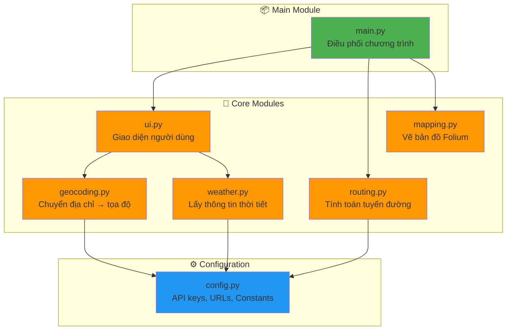

## Sơ đồ Tổng Quan Chương Trình Main

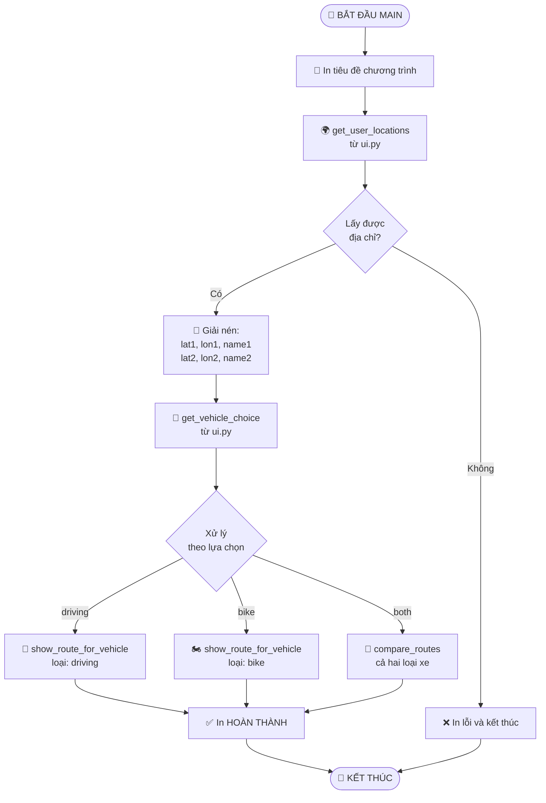

## Module: config.py

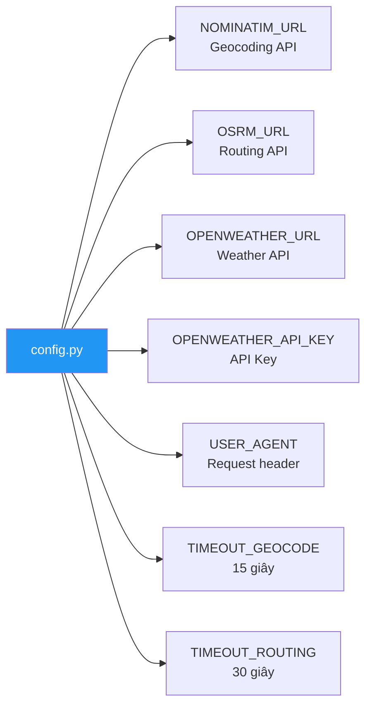

## Module: geocoding.py - Hàm geocode()

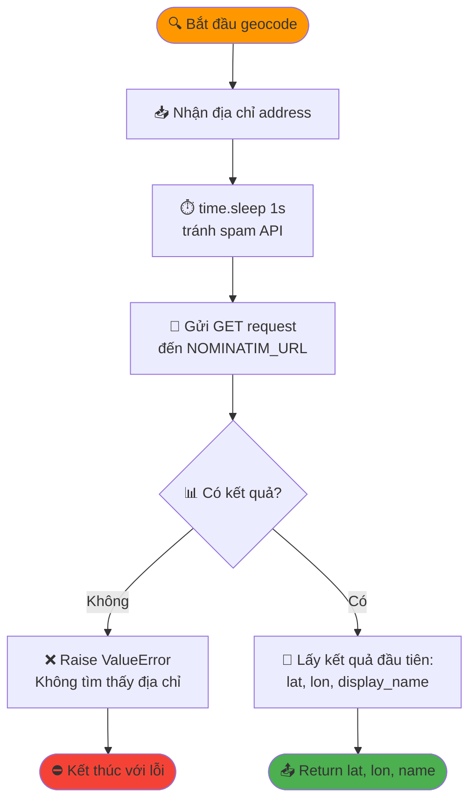

## Module: routing.py - Hàm get_route_geometry()

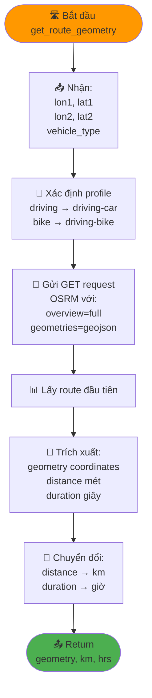

## Module: routing.py - Hàm get_route_steps()

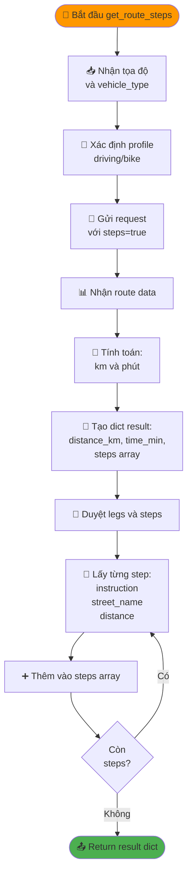

## Module: weather.py - Hàm get_weather()

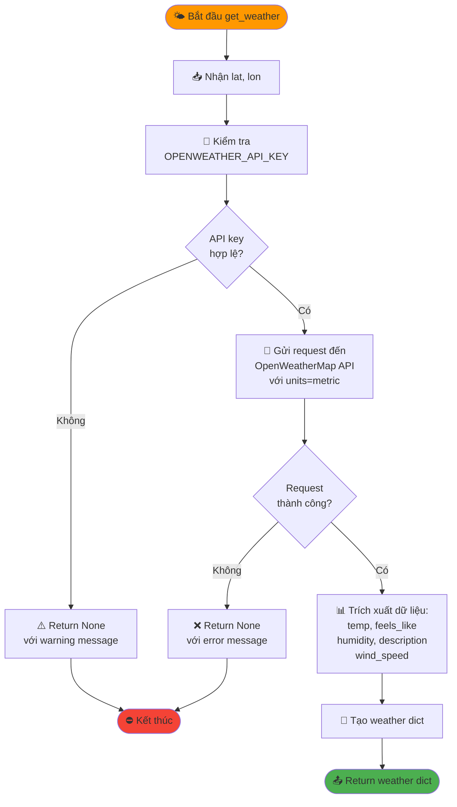

## Module: mapping.py - Hàm create_single_vehicle_map()

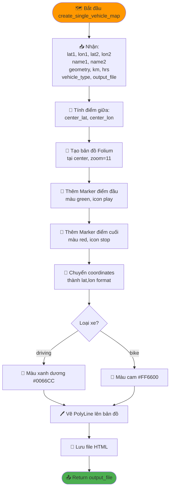

## Module: mapping.py - Hàm create_comparison_map()

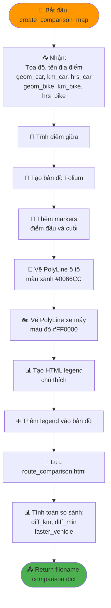

## Module: ui.py - Hàm get_vehicle_choice()

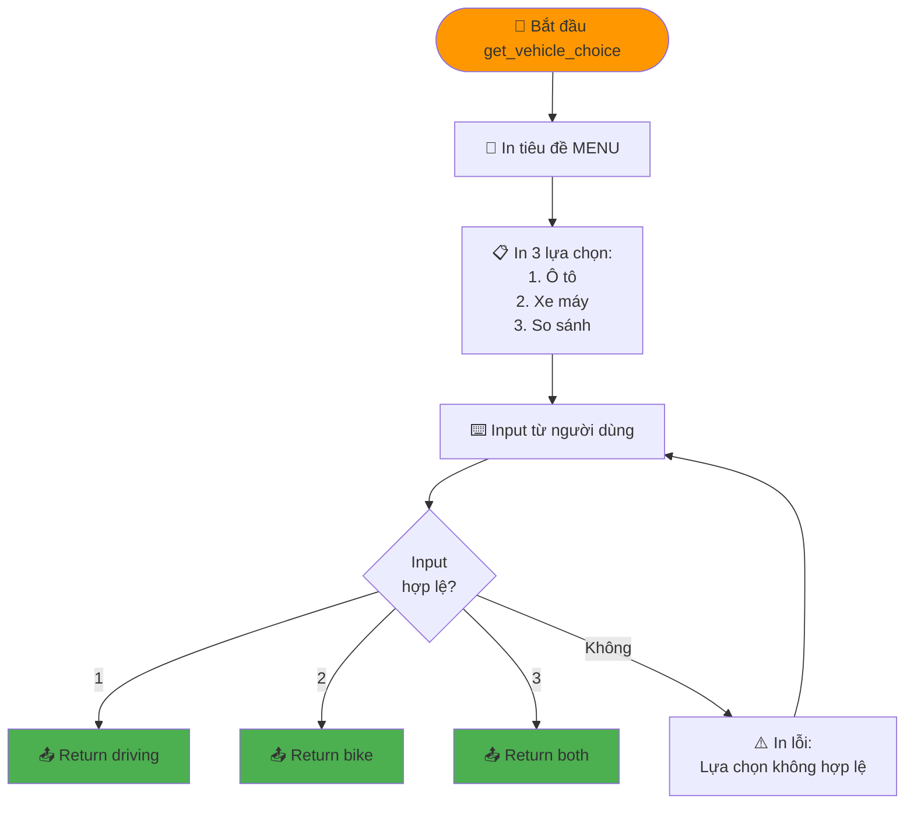

## Module: ui.py - Hàm get_user_locations()

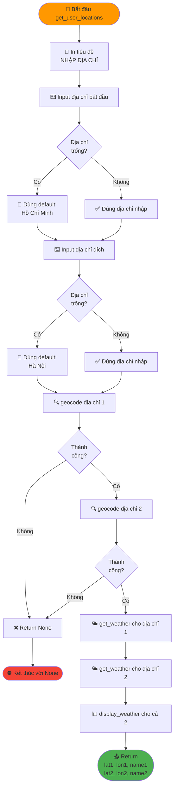

## Module: ui.py - Hàm display_weather()

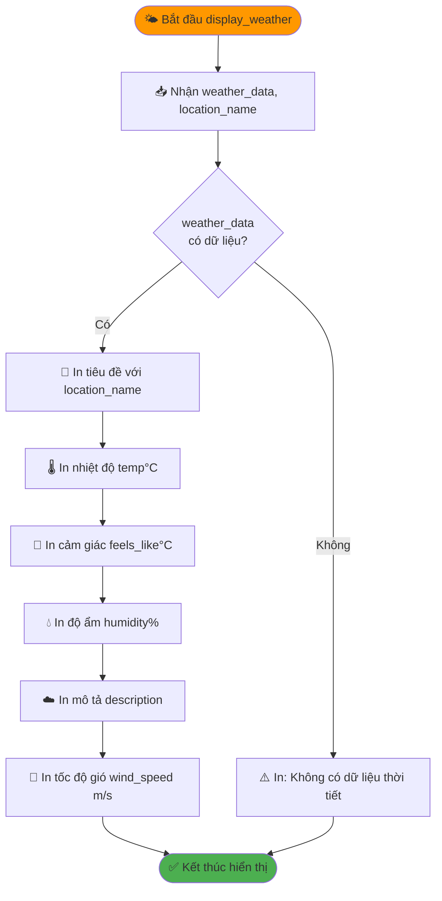

## Module: ui.py - Hàm display_route_steps()

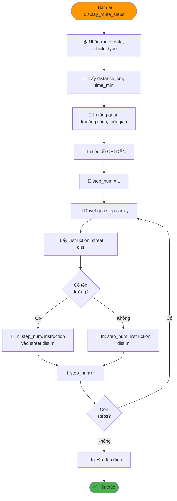

## Module: ui.py - Hàm display_comparison_result()

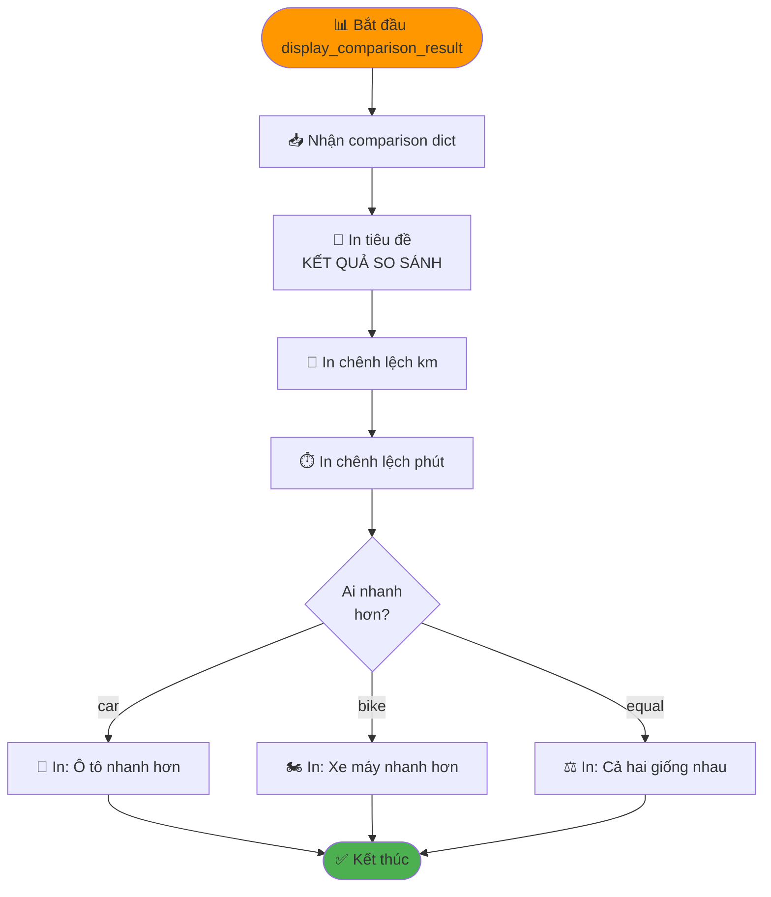

## Hàm show_route_for_vehicle() trong main.py

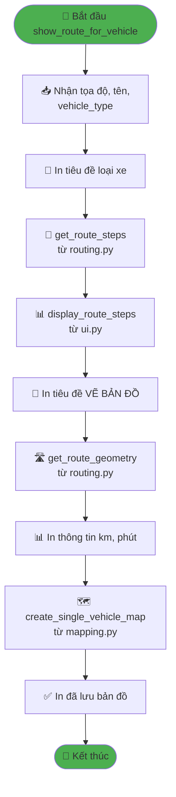

## Hàm compare_routes() trong main.py

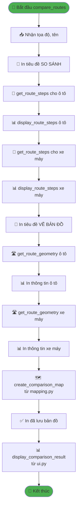

## Sơ đồ Luồng Dữ Liệu

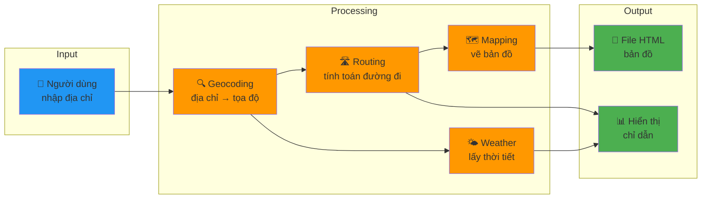

## Bảng Chức Năng Modules

| Module | File | Chức năng chính | Dependencies |
|--------|------|-----------------|--------------|
| **Config** | `config.py` | Cấu hình API URLs, keys, timeouts | Không |
| **Geocoding** | `geocoding.py` | `geocode(address)` → lat, lon, name | config.py, requests |
| **Routing** | `routing.py` | `get_route_geometry()`, `get_route_steps()` | config.py, requests |
| **Weather** | `weather.py` | `get_weather(lat, lon)` → weather dict | config.py, requests |
| **Mapping** | `mapping.py` | `create_single_vehicle_map()`, `create_comparison_map()` | folium |
| **UI** | `ui.py` | `get_vehicle_choice()`, `get_user_locations()`, `display_*()` | geocoding.py, weather.py |
| **Main** | `main.py` | `main()`, `show_route_for_vehicle()`, `compare_routes()` | ui.py, routing.py, mapping.py |

## Bảng API Endpoints

| API | URL | Mục đích | Module sử dụng |
|-----|-----|----------|----------------|
| **Nominatim** | `https://nominatim.openstreetmap.org/search` | Geocoding (địa chỉ → tọa độ) | geocoding.py |
| **OSRM** | `https://router.project-osrm.org/route/v1/` | Routing (tính đường đi) | routing.py |
| **OpenWeather** | `https://api.openweathermap.org/data/2.5/weather` | Weather (thông tin thời tiết) | weather.py |

## Cấu Trúc File Output

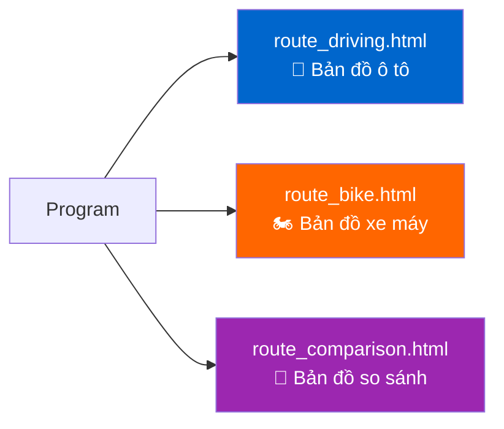

## Ghi Chú Kỹ Thuật

### Ưu điểm của Cấu trúc Module:
1. **Separation of Concerns**: Mỗi module có trách nhiệm riêng
2. **Reusability**: Có thể tái sử dụng các hàm dễ dàng
3. **Maintainability**: Dễ bảo trì và sửa lỗi
4. **Testability**: Dễ viết unit test cho từng module
5. **Scalability**: Dễ mở rộng thêm tính năng mới

### Quy tắc Import:
- `main.py` import từ `ui`, `routing`, `mapping`
- `ui.py` import từ `geocoding`, `weather`
- `geocoding`, `routing`, `weather` import từ `config`
- Không có circular imports

### Error Handling:
- `geocode()`: Raise ValueError nếu không tìm thấy
- `get_weather()`: Return None nếu lỗi
- `get_user_locations()`: Return None nếu lỗi geocoding
- `main()`: Kiểm tra None trước khi xử lý
